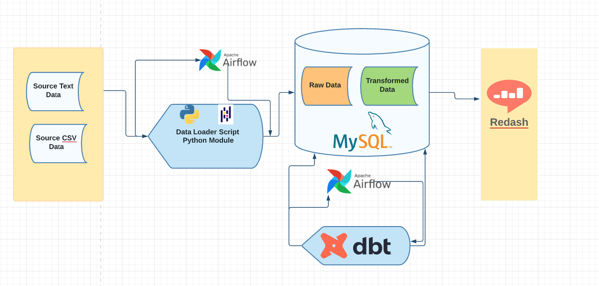

[![Contributors][contributors-shield]][contributors-url]
[![Forks][forks-shield]][forks-url]
[![Stargazers][stars-shield]][stars-url]
[![Issues][issues-shield]][issues-url]
[![MIT License][license-shield]][license-url]
[![LinkedIn][linkedin-shield]][linkedin-url]


<!-- PROJECT LOGO -->
<br />
<p align="center">
  <a href="https://github.com/daniEL2371/sensor-data-ELT">
    
  </a>

  <h3 align="center">Sensor Data ELT</h3>

  <p align="center">
    A fully dockerized ELT pipeline project, using MYSQL, dbt, Apache Airflow, and Redash.
    <br />
    <a href="https://github.com/daniEL2371/sensor-data-ELT"><strong>Explore the docs »</strong></a>
    <br />
    <br />
    <a href="https://github.com/daniEL2371/sensor-data-ELT">View Demo</a>
    ·
    <a href="https://github.com/daniEL2371/sensor-data-ELT/issues">Report Bug</a>
    ·
    <a href="https://github.com/daniEL2371/sensor-data-ELT/issues">Request Feature</a>
  </p>
</p>


<!-- TABLE OF CONTENTS -->
<details open="open">
  <summary>Table of Contents</summary>
  <ol>
    <li>
      <a href="#about-the-project">About The Project</a>
      <ul>
        <li><a href="#built-with">Built With</a></li>
      </ul>
    </li>
    <li>
      <a href="#getting-started">Getting Started</a>
      <ul>
        <li><a href="#prerequisites">Prerequisites</a></li>
        <li><a href="#installation">Installation</a></li>
      </ul>
    </li>
    <li><a href="#usage">Usage</a></li>
    <li><a href="#roadmap">Roadmap</a></li>
    <li><a href="#contributing">Contributing</a></li>
    <li><a href="#license">License</a></li>
    <li><a href="#contact">Contact</a></li>
    <li><a href="#acknowledgements">Acknowledgements</a></li>
  </ol>
</details>


<!-- ABOUT THE PROJECT -->
## About The Project

[![Product Name Screen Shot][product-screenshot]](https://example.com)

A fully dockerized using a docker-compose file ELT pipeline using MySQL, Airflow, DBT and Redash. used MySQL for data storage. used DBT for data transforming and airflow for automation and orchestrations. A redash dasboard is built by connecting it to mysql databse.
### Built With

Tech Stack used in this project
* [MYSQL](https://getbootstrap.com)
* [Apache Airflow](https://jquery.com)
* [dbt](https://laravel.com)
* [Redash](https://laravel.com)


<!-- GETTING STARTED -->
## Getting Started


### Prerequisites

Make sure you have docker installed on local machine.
* Docker
* DockerCompose
  
### Installation

1. Clone the repo
   ```sh
   git clone https://github.com/daniEL2371/sensor-data-ELT.git
   ```
2. Run
   ```sh
    docker-compose build
    docker-compose up
   ```
3. Open Airflow web browser
   ```JS
   Navigate to `http://localhost:8000/` on the browser
   activate and trigger dbt_load_dag
   activate and trigger dbt_dbt_dag
   ```
4. Access redash dashboard
   ```JS
   Navigate to `http://localhost:5000/` on the browser
   ```

<!-- CONTRIBUTING -->
## Contributing

Contributions are what make the open source community such an amazing place to learn, inspire, and create. Any contributions you make are **greatly appreciated**.

1. Fork the Project
2. Create your Feature Branch (`git checkout -b feature/AmazingFeature`)
3. Commit your Changes (`git commit -m 'Add some AmazingFeature'`)
4. Push to the Branch (`git push origin feature/AmazingFeature`)
5. Open a Pull Request


<!-- LICENSE -->
## License

Distributed under the MIT License. See `LICENSE` for more information.


<!-- CONTACT -->
## Contact

Daniel Zelalem - [@your_twitter](https://twitter.com/your_username) - danielzelalemheru@gmail.com


<!-- ACKNOWLEDGEMENTS -->
## Acknowledgements
* [10 Academy](https://www.webpagefx.com/tools/emoji-cheat-sheet)


<!-- MARKDOWN LINKS & IMAGES -->
<!-- https://www.markdownguide.org/basic-syntax/#reference-style-links -->
[contributors-shield]: https://img.shields.io/github/contributors/daniEL2371/sensor_data_elt.svg?style=for-the-badge
[contributors-url]: https://github.com/daniEL2371/sensor_data_elt/graphs/contributors
[forks-shield]: https://img.shields.io/github/forks/daniEL2371/sensor_data_elt.svg?style=for-the-badge
[forks-url]: https://github.com/daniEL2371/sensor_data_elt/network/members
[stars-shield]: https://img.shields.io/github/stars/daniEL2371/sensor_data_elt.svg?style=for-the-badge
[stars-url]: https://github.com/daniEL2371/sensor_data_elt/stargazers
[issues-shield]: https://img.shields.io/github/issues/daniEL2371/sensor_data_elt.svg?style=for-the-badge
[issues-url]: https://github.com/daniEL2371/sensor_data_elt/issues
[license-shield]: https://img.shields.io/github/license/daniEL2371/sensor_data_elt.svg?style=for-the-badge
[license-url]: https://github.com/daniEL2371/sensor_data_elt/blob/master/LICENSE.txt
[linkedin-shield]: https://img.shields.io/badge/-LinkedIn-black.svg?style=for-the-badge&logo=linkedin&colorB=555
[linkedin-url]: https://linkedin.com/in/othneildrew
[product-screenshot]: images/architecture.png

